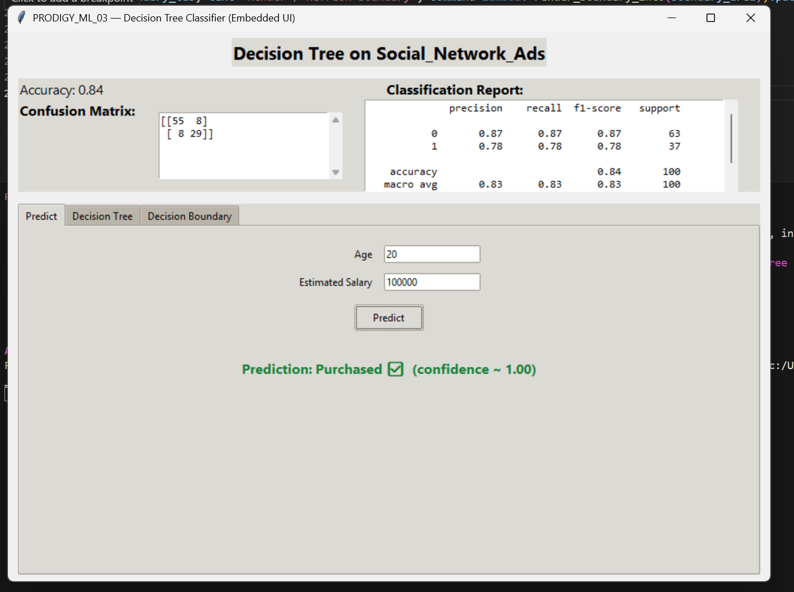
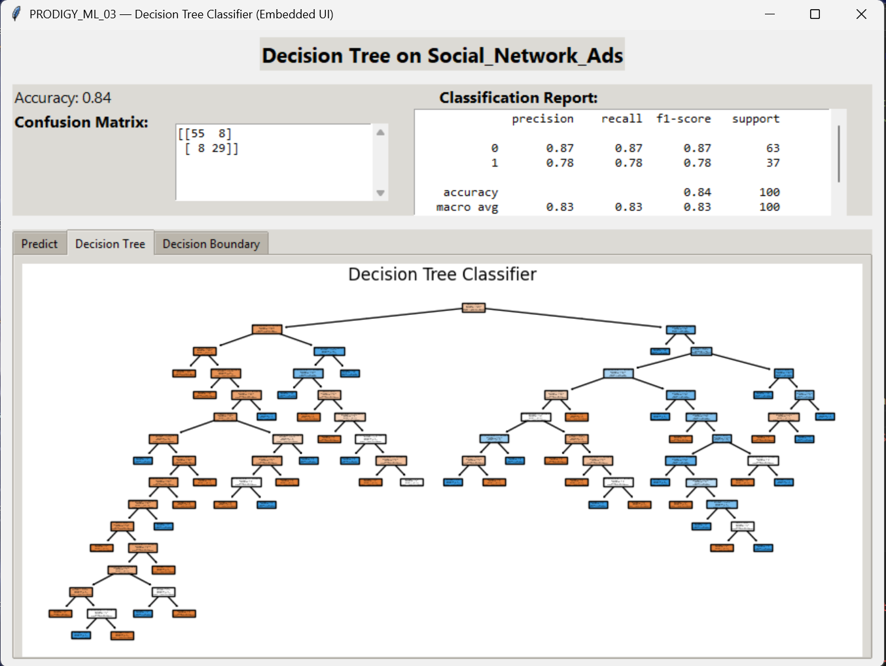

# PRODIGY_ML_03 - Decision Tree Classifier with Tkinter UI  

## 📌 Overview  
This project implements a **Decision Tree Classifier** using Python.  
It includes a **Tkinter-based GUI** for interactive predictions and also generates visualizations of the decision tree.  

---

## 🚀 Features  
- Train and test a Decision Tree Classifier on the dataset.  
- GUI-based interface for user input and prediction.  
- Visual representation of the decision tree.  
- Easy-to-use and interactive.  

---

## 🗂️ Dataset  
The dataset used is **Social_Network_Ads.csv**, which contains:  
- User ID  
- Gender  
- Age  
- Estimated Salary  
- Purchased (Target Variable)  

---

## 🖼️ Example Output  

### GUI Interface  
  

### Decision Tree Plot  
  

---

## ⚙️ Installation & Usage  

1. Clone this repository:  
   ```bash
   git clone https://github.com/Pawan-ghildiyal/PRODIGY_ML_03.git
   cd PRODIGY_ML_03
