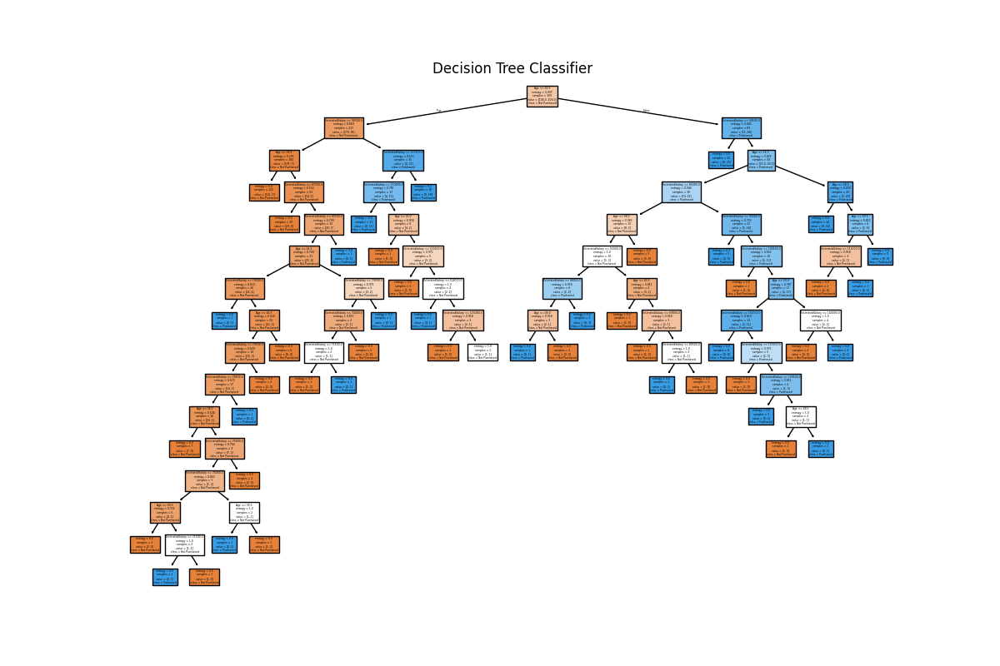

# PRODIGY_ML_03 - Decision Tree Classifier with Tkinter UI

This project is a **machine learning application** built with Python, using a **Decision Tree Classifier** to classify user data.  
It includes an **interactive Tkinter-based GUI** for easy dataset loading, training, prediction, and visualization.

---

## 📌 Features
- Load dataset from CSV (default: `data/Social_Network_Ads.csv`)
- Train a Decision Tree Classifier
- Display model accuracy
- Interactive GUI built with Tkinter
- Visualize the trained decision tree using Matplotlib
- User-friendly interface for predictions

---

## 🛠️ Technologies Used
- **Python 3.x**
- **Tkinter** (GUI)
- **Pandas** (data handling)
- **Scikit-learn** (machine learning)
- **Matplotlib** (visualization)

---

## 📂 Project Structure
PRODIGY_ML_03/
│
├── data/
│ └── Social_Network_Ads.csv 
│
├── decision_tree_classifier.py
├── requirements.txt 
├── Figure_1.png 
├── Figure_2.png 
└── README.md

---

## 🚀 Installation & Usage

### 1️⃣ Clone the Repository
```bash
git clone https://github.com/Pawan-ghildiyal/PRODIGY_ML_03.git
cd PRODIGY_ML_03

2️⃣ Install Dependencies
pip install -r requirements.txt

3️⃣ Run the Application
python decision_tree_classifier.py

📊 Example Output

Model accuracy will be shown in the GUI.
Decision tree visualization will open in a Matplotlib window.

📷 Screenshots

| GUI Interface          | Decision Tree Plot |
| ---------------------- | ------------------ |
|    |  |


📊 Example Dataset

This project includes Social_Network_Ads.csv, a sample dataset for binary classification.
You can replace it with your own CSV file to train on different data.

Sample Columns:
Age
EstimatedSalary
Purchased

💡 How It Works

Load dataset from file or use the default one.
Train the Decision Tree Classifier.
View the generated decision tree visualization.
Enter input values in the GUI for predictions.
See the results instantly without needing to touch code.


📜 License
This project is licensed under the MIT License.


👨‍💻 Developed by
Pawan Ghildiyal